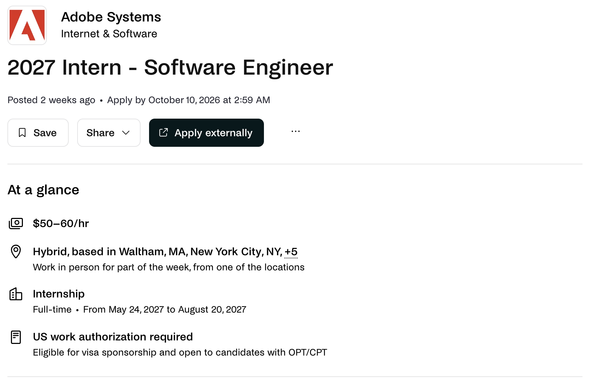
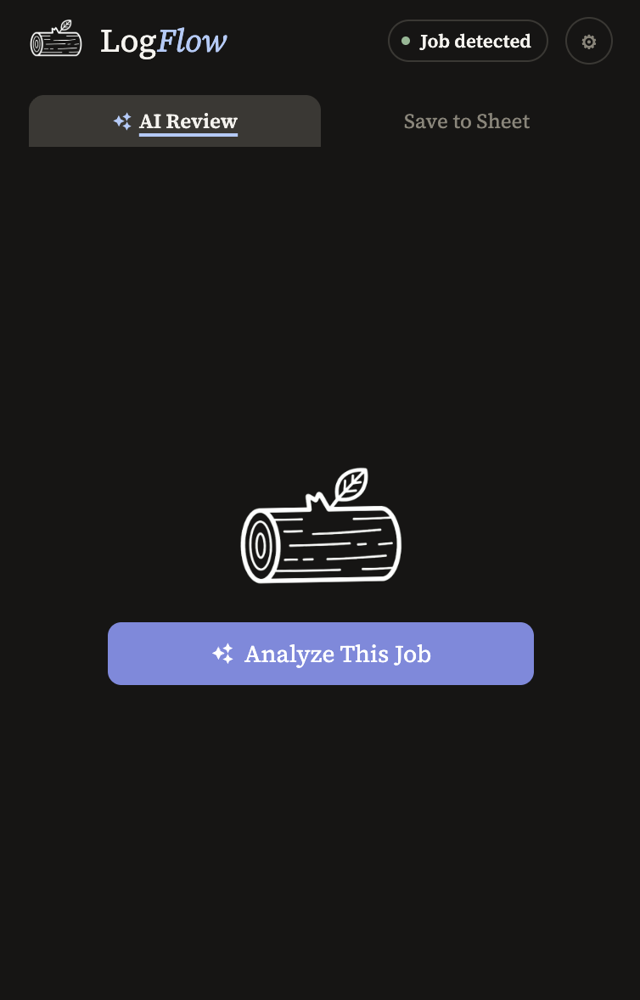
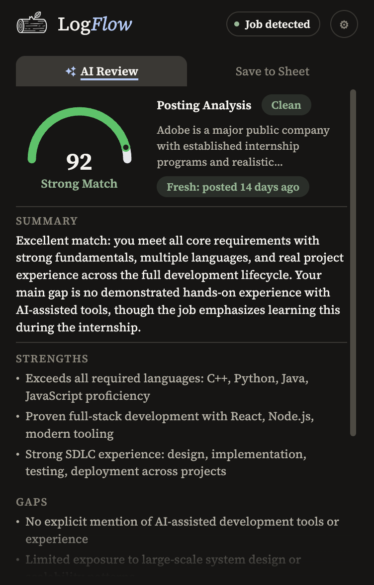
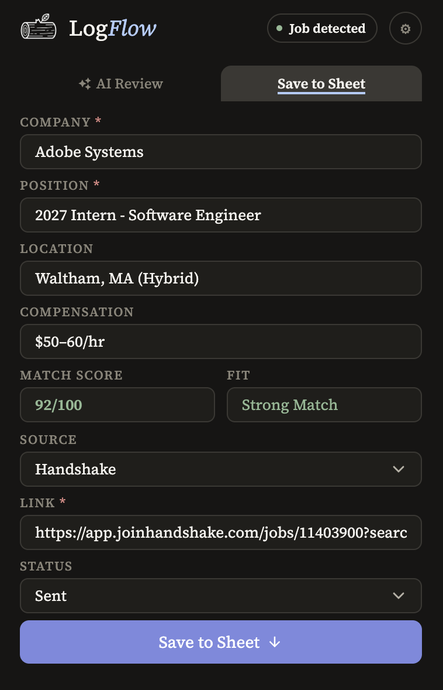
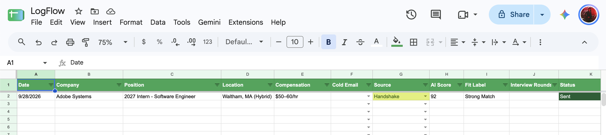

# LogFlow

An AI-powered Chrome extension that reviews and tracks your job applications. Open any job posting, launch the LogFlow extension, and it scores how well your resume fits the role, flags skill gaps and suspicious postings, and saves the application to a formatted Google Sheet, all in a couple of clicks.

Under the hood it's a full pipeline: a Manifest V3 extension → an AWS Lambda backend (which keeps the AI key server-side) → Anthropic's Claude. The AI features are backed by an **evaluation harness** that measures whether the model's output is actually any good — see [Evaluation](#evaluation).

> **📂 About this repo.** This is the public portfolio view of LogFlow — it includes the **evaluation harness**, the **scoring logic**, and the **deterministic keyword-coverage metric** (the parts I most want reviewed). The full extension source (UI, page scraper, Google + AWS integration) is kept private during active development and opened up as it's cleaned. Happy to walk through any of it.

## What LogFlow solves
I was job searching with AI and had too many tabs open, plus a Google Sheet to track every job. Clicking back and forth was such a pain.

Some job listings are from fake companies and need more investigation.

I didn't want my personal and resume information being sent to unverified companies.

## Features

**AI Review**
- **Resume match score** — a 0–100 compatibility score with a fit label (Strong / Good / Partial / Weak)
- **Strengths & gaps** — the most relevant matches and misses between your resume and the posting
- **Keyword coverage** — a *deterministic* matched/missing breakdown of the skills the posting asks for (computed in code, not guessed by the AI)
- **Posting legitimacy** — flags a posting as Clean / Suspicious / Unclear from its text (scam-signal detection)
- **Posting freshness** — detects whether a listing is fresh, stale, or closed
- **Bring your own key (optional)** — use your own Anthropic API key, or the zero-setup shared default

**Tracking**
- **Auto-fills from the page** — detects company, position, location, compensation, and source
- **One-click save** — writes the entry (plus the AI score, if you ran one) to your Google Sheet
- **Google Drive integration** — a formatted **LogFlow** sheet is created automatically on first save
- **Duplicate & repost detection** — warns if you've already tracked a URL, or a similar posting under a different link
- **Page detection** — tells you when a page doesn't look like a job listing, but still lets you save manually
- **Works on** — LinkedIn, Handshake, IBM, Amazon, and most company career pages

**Privacy**
- Your resume text is **never stored server-side** — it's sent over HTTPS to the AI and never written to any database
- The AI API key lives only in AWS Secrets Manager, never in the extension
- A **Delete My Data** button clears all local data and revokes access

## Demo

**1. Open a job posting.**



**2. Open LogFlow and hit Analyze on the AI Review tab.**



**3. Get your fit score, summary, strengths, gaps, and a posting-legitimacy check.**



**4. Switch to Save to Sheet — the fields auto-fill — and save to your Google Sheet.**



**5. Your application lands in a formatted LogFlow sheet — with the AI score and fit label saved alongside it.**



## How It Works

```
Extension  ──HTTPS──▶  API Gateway  ──▶  AWS Lambda  ──▶  Anthropic Claude
                                           │
                    ┌──────────────────────┼───────────────────────┐
              Secrets Manager        DynamoDB                 scoring.js
              (AI API key)      (rate limits +           (pure scoring fn +
                                 token cache)          deterministic coverage)
```

- **Why Lambda?** An AI key shipped inside a browser extension can be unpacked and stolen. Routing every request through Lambda keeps the key in Secrets Manager and enforces rate limits centrally.
- **Deterministic keyword coverage.** The AI only *extracts* the skills a posting asks for; the matched/missing coverage is then computed by plain code (`keywordCoverage.js`) — inspectable and reproducible, not an invented number.
- **Auth & limits.** Google sign-in is validated in Lambda (with an audience check and a hashed validation cache), and requests are rate-limited per user per day with a global cap to protect the public endpoint.

## Evaluation

Here `evals/scoring/` is a small harness that measures whether the output is any good and produces results you can review to improve LogFlow's output.

- **Labeled dataset with a held-out split** — hand-labeled `(resume, job)` cases split into a `dev` set (used to tune) and a `test` set (never seen during tuning; the reported number comes from here).
- **Deterministic graders** — pure functions that check each output: score-band direction, keyword coverage, legitimacy classification, response-schema validity, and adversarial resistance.
- **Adversarial injection battery** — 6 prompt-injection payloads across 4 attack types (score inflation, candidate-PII exfiltration, app/secret reconnaissance, and system-prompt disclosure). The harness verifies the model isn't hijacked and nothing leaks.

**Current results:** `DEV 11/11 · TEST 8/8` on the held-out split.

```
node evals/scoring/run-eval.js          # runs dev + held-out test, prints a pass/fail table
```

> The eval code and labels (`dev.jsonl` / `test.jsonl`) are here; the fixtures (a real resume + real job postings) are kept out as PII, so a full run needs your own resume/postings and an Anthropic API key.

## Full extension

The complete Chrome extension — popup UI, page scraper, Google Sheets + AWS Lambda (API Gateway, DynamoDB, Secrets Manager) integration, and Google OAuth — lives in a private repo during active development. Reach out if you'd like a walkthrough or demo.

## Project Structure (this repo)

```
logflow/
├── scoring.js             # Pure scoreResumeAgainstJob: prompt, Claude call, response validation
├── keywordCoverage.js     # Deterministic keyword-coverage metric (code, not the LLM)
├── evals/
│   └── scoring/
│       ├── dev.jsonl       # Labeled cases used to tune (dev split)
│       ├── test.jsonl      # Held-out cases (the reported number)
│       ├── graders.js      # Pure deterministic grader functions
│       └── run-eval.js     # Runner: scores each case, grades, prints the table
└── screenshots/           # Demo images
```

## Work in Progress
- **Chrome Web Store launch** — install without the Google Cloud setup step
- **Legitimacy classifier eval** — a confusion matrix vs. a baseline (precision / recall / false-positive rate) to measure how much to trust the scam badge
- **AI agents** — a company-verification agent that actually researches the employer (web presence, domain age, registration) to back the scam check with real evidence instead of only reading the posting text — closing the biggest gap in the current legitimacy check
- **Unit tests + CI** — GitHub Actions gating the deterministic core on every push
- **Prompt calibration** — tuning the score distribution so strong and mediocre matches separate more cleanly
- **Parser hardening** — better handling of multi-location postings and site DOM changes

## Tech Stack

- **Frontend:** Chrome Extension Manifest V3, Vanilla JS (ES Modules)
- **Backend:** AWS Lambda (Node.js), API Gateway, DynamoDB, Secrets Manager
- **AI:** Anthropic Claude (Haiku)
- **Integrations:** Google Sheets API v4, Google Identity (OAuth2 via `chrome.identity`)

## Contact
- Email: [Kongndavid@gmail.com](mailto:Kongndavid@gmail.com)
- LinkedIn: [linkedin.com/in/davidnkong](https://www.linkedin.com/in/davidnkong/)
- GitHub: [github.com/dvaidwho](https://github.com/dvaidwho)